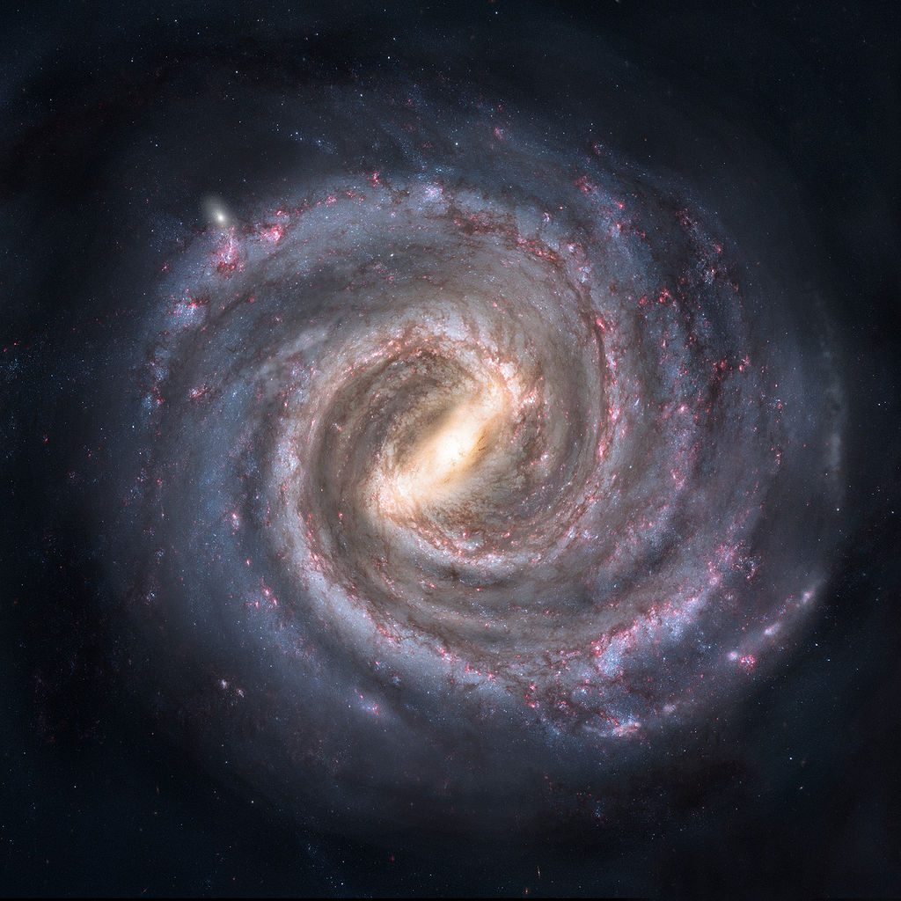
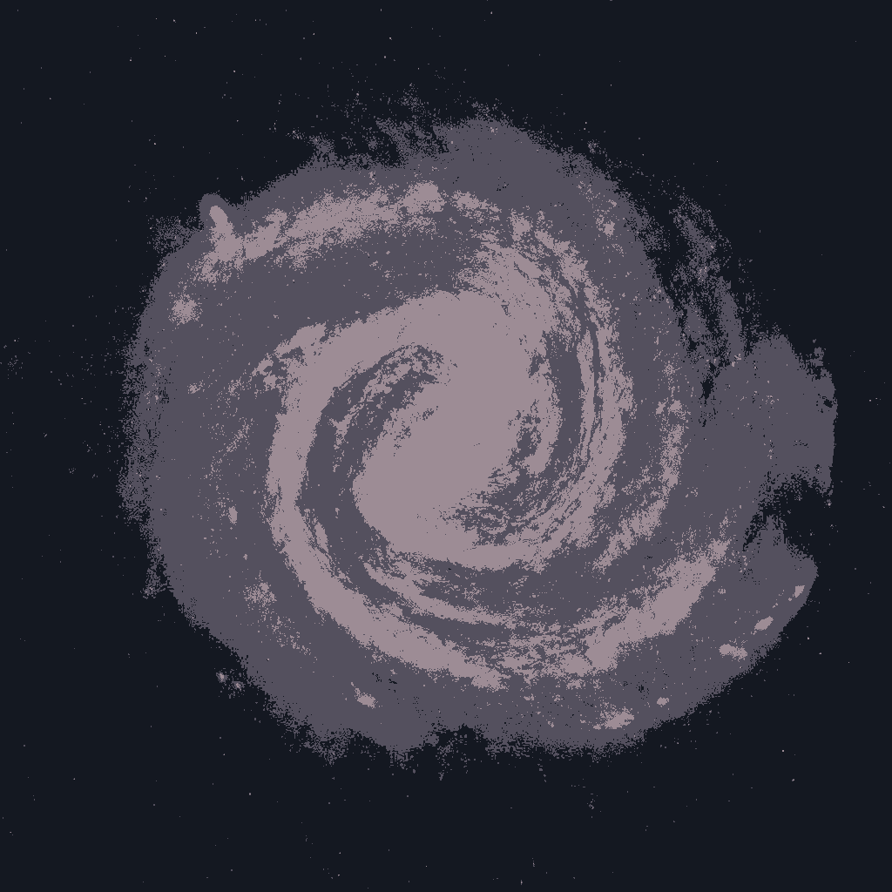
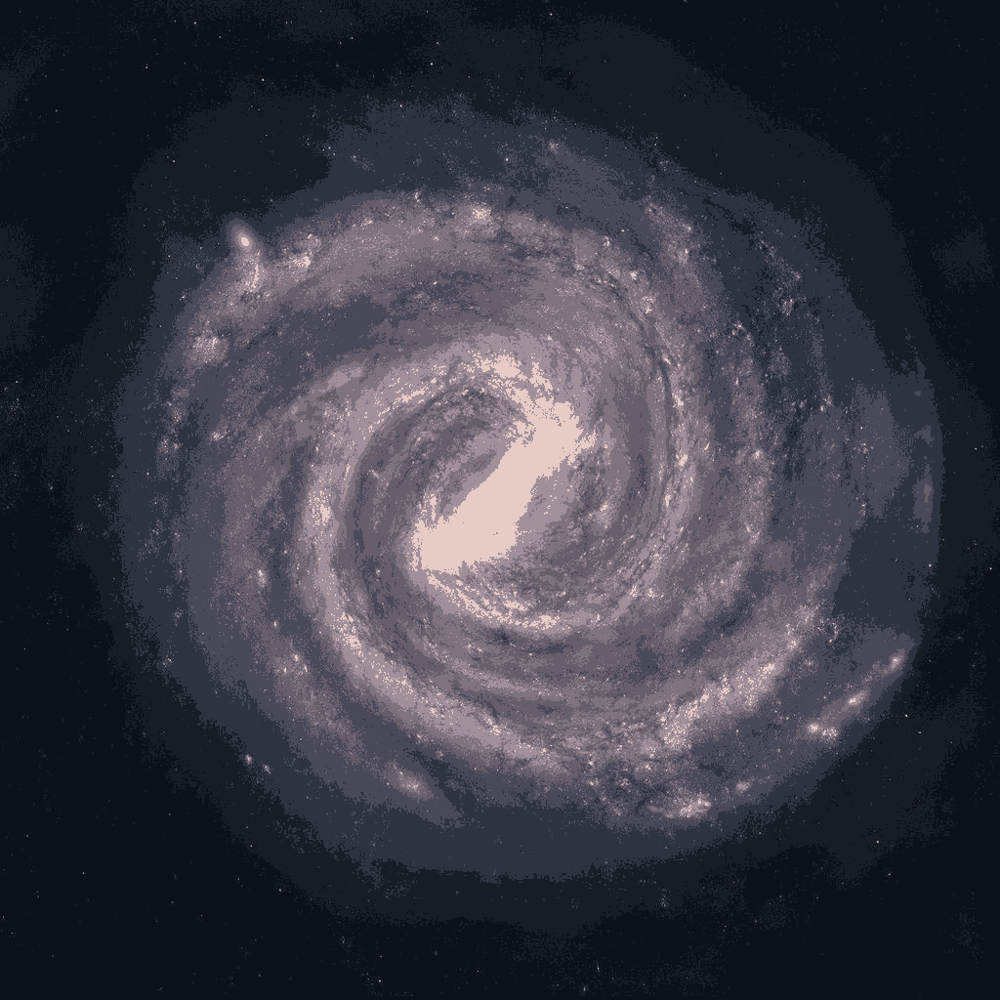
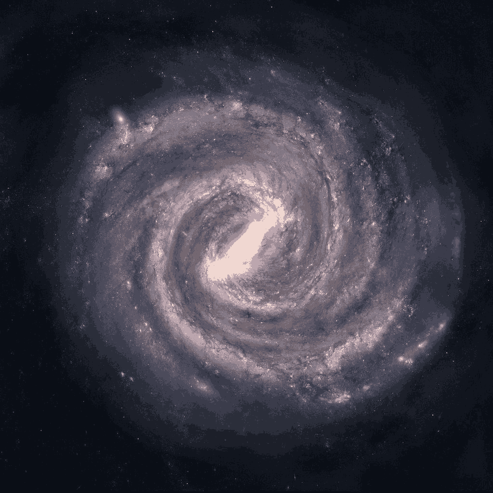

# Fuzzy C-Means in Rust

[](https://github.com/memedanslortie/fuzzy-c-means-rust/actions/workflows/ci.yml)

A from-scratch implementation of **Fuzzy C-Means (FCM)** clustering in Rust using
`ndarray`, applied to **color image segmentation**. Unlike k-means, every pixel gets a
*soft* membership degree in each cluster.

> Coursework, M2 Vision & Machine Intelligence, Université Paris Cité (2025).

| Input | k = 3, m = 1.5 | k = 8, m = 2.5 | k = 12, m = 1.8 |
|:-:|:-:|:-:|:-:|
|  |  |  |  |

## Algorithm

Given pixels $x_i$ in RGB space, $c$ clusters and a fuzziness exponent $m > 1$, the
algorithm alternates two steps until the largest membership change is below $\varepsilon$:

$$
C_j = \frac{\sum_i u_{ij}^m \, x_i}{\sum_i u_{ij}^m}
\qquad
u_{ij} = \left( \sum_{k=1}^{c} \left( \frac{\lVert x_i - C_j \rVert}{\lVert x_i - C_k \rVert} \right)^{\frac{2}{m-1}} \right)^{-1}
$$

Implementation notes:
- Memberships start random and are normalized row-wise to sum to 1.
- When a pixel coincides with a center, that pixel gets a hard assignment, which avoids a
  division by zero.
- The segmented image colors each pixel with the center of its highest-membership cluster.

## Usage

```bash
cargo run --release                      # segments assets/milky-way.jpg with 5 parameter sets
cargo run --release -- path/to/image.jpg # any other image
```

Outputs go to `fcm_outputs/`, with file names that encode the parameters
(`seg_<run>_k<clusters>_m<fuzziness>_eps<tolerance>_it<max_iter>.png`).

## Stack

Rust · ndarray · ndarray-rand · image
